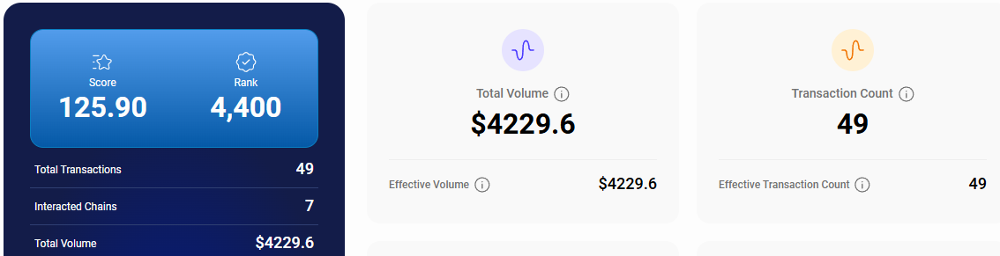
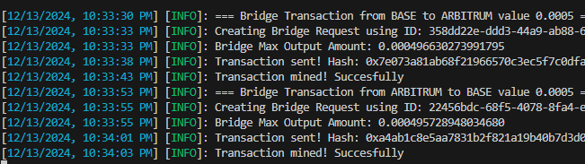
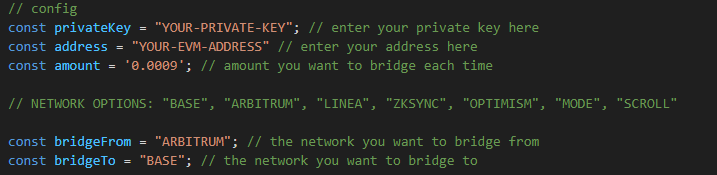

# RANGO EXCHANGE AUTO BRIDGE



# Rango
Rango Exchange | The ultimate cross-chain aggregator. 🔥 Backed by BinanceLabs.                             
Integrated by TrustWallet, Binance Web3 Wallet, and +50 partners.
- WEBSITE [https://app.rango.exchange](https://app.rango.exchange/profile)
- TWITTER [@RangoExchange](https://x.com/RangoExchange)


## Features

- **Auto Bridge Transaction** to increase volume on rango exchange
- **Track your Score in Rango's profile! Here** [https://app.rango.exchange/profile](https://app.rango.exchange/profile)

## Requirements

- **Node.js**: Ensure you have Node.js installed.
- **npm**: Ensure you have npm installed.

    
## Setup

1. Clone this repository:
   ```bash
   git clone https://github.com/Zlkcyber/rango.git
   cd rango
   ```
2. Install dependencies:
   ```bash
   npm install
   ```
3. Setup: edit config.js and input your wallet address
   ```bash
   nano config.js
   ```
   
4. Run The Script:
   ```bash
   npm run start
   ```


## 

This project is licensed under the [MIT License](LICENSE).
